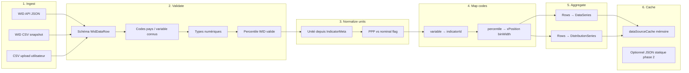

# B — Clean Data

> Schémas canoniques, pipeline Raw → Clean, convertisseurs et versioning.  
> Extension des types actuels dans `webapp/src/domain/types.ts`.

---

## B1 — Schéma canonique

### Version

```typescript
export const CLEAN_SCHEMA_VERSION = '1.0.0'
```

Toute entité clean exportée ou persistée inclut `schemaVersion: typeof CLEAN_SCHEMA_VERSION`.

### Types de référence (cible)

Les types ci-dessous **étendent** l’existant sans casser la webapp MVP. Les champs marqués *(nouveau)* sont à ajouter lors de l’implémentation pipeline.

```typescript
// webapp/src/domain/types.ts — état actuel + extensions cibles

export interface Provenance {
  sourceId: string          // ex. 'wid'
  indicatorId: string       // ex. 'sptinc'
  vintage?: string          // ex. '2024-06-01' — date snapshot ou fetch
  methodology?: string      // ex. 'DINA pre-tax national income'
  sourceUrl?: string        // ex. 'https://wid.world/data/?variables=sptinc&...'
  retrievedAt?: string      // ISO 8601
}

export interface SeriesPoint {
  year: number
  value: number
  quality?: 'observed' | 'imputed' | 'missing'  // *(nouveau)* — imputed jamais affiché sans flag UI
}

export interface DataSeries {
  id: string
  label: string
  unit?: string
  points: SeriesPoint[]
  metadata?: Record<string, string | number | boolean>
  provenance?: Provenance       // *(nouveau)*
  schemaVersion?: string        // *(nouveau)*
}

export interface DistributionPoint {
  percentile: string            // notation WID — voir ci-dessous
  value: number
  xPosition?: number            // *(nouveau)* position axe fractal 0–100
  binWidth?: number             // *(nouveau)* largeur tranche (1, 0.1, 0.01, 0.001)
}

export interface DistributionSeries {
  id: string
  label: string
  year: number
  unit?: string                   // *(nouveau)*
  points: DistributionPoint[]
  provenance?: Provenance
  schemaVersion?: string
}

export interface IndicatorMeta {
  id: string
  label: string
  description?: string
  unit?: string
  sourceId: string
  widVariableCode?: string        // *(nouveau)* lien explicite code WID
  population?: string             // *(nouveau)* ex. 'adults pre-tax'
  taxConcept?: 'pretax' | 'posttax' | 'wealth'  // *(nouveau)*
}

export interface CountryOption {
  code: string
  label: string
  widAreaCode?: string            // *(nouveau)* si différent ISO
}

// Types inchangés MVP
export interface ScatterPoint { x: number; y: number; label?: string; year?: number }
export interface FetchSeriesParams { countryCode: string; indicatorId: string; yearFrom?: number; yearTo?: number }
export interface FetchDistributionParams { countryCode: string; indicatorId: string; year?: number }
export interface SearchIndicatorsParams { query?: string; countryCode?: string }
```

### Conventions

| Dimension | Convention |
|-----------|------------|
| **Année** | Entier calendaire (`1980`, `2024`) |
| **Percentiles WID** | Chaîne `p{lower}p{upper}` — voir séquence fractale |
| **Unités revenu/part** | `%` pour parts ; index 0–1 pour Gini |
| **Unités patrimoine** | EUR PPP par défaut (`ahwbus`) ; EUR nominal si série WID l’indique — **ne pas mélanger** sans conversion documentée |
| **Devise** | Champ `unit` + note `methodology` ; pas de conversion FX implicite MVP |
| **Pays** | Code WID = ISO 2 lettres MVP |

### Notation percentiles WID (alignée sur `zoom_fractal.py`)

Séquence **127 tranches** pour le zoom fractal :

| Segment | Tranches | Codes exemple | Largeur axe X |
|---------|----------|---------------|---------------|
| A — 99 premiers % | 99 | `p0p1` … `p98p99` | 1.0 chacune |
| B — top 1 % (dixièmes) | 9 | `p99p99.1`, …, `p99.8p99.9` | 0.1 |
| C — top 0.1 % (centièmes) | 9 | `p99.9p99.91`, … | 0.01 |
| D — top 0.01 % (millièmes) | 9 | `p99.99p99.991`, … | 0.001 |
| Sommet | 1 | `p99.999p100` | 0.001 |

Référence implémentation Python : `Stage_gscop/zoom_fractal.py` lignes 7–40.

Le convertisseur clean **conserve** la chaîne percentile source et **calcule** `xPosition` / `binWidth` via la même logique (port TypeScript ou lookup table générée).

### Politique de justification des écarts vs source

| Transformation | Justification requise |
|----------------|---------------------|
| Renommage `variable` → `indicatorId` | Alias stable UI ; code WID conservé dans `provenance.indicatorId` |
| Filtrage années hors fenêtre | Paramètre utilisateur — pas de perte silencieuse |
| Agrégation percentiles → déciles | **Interdit MVP** sauf convertisseur dédié documenté |
| Conversion PPP → nominal | Formule + source taux ; hors MVP |
| Tri / déduplication | Idempotence pipeline — ordre chronologique garanti |

---

## Pipeline Raw → Clean



### Idempotence

- Même entrée Raw + même `schemaVersion` → même sortie clean (ordre des `points` déterministe).
- Les étapes validate → map sont pures (pas d’effet de bord).
- Cache clé : `sourceId + operation + hash(params)` — voir `dataSourceCache.buildKey`.

### Ordre imposé (cf. A Faire.txt)

1. **ingest** — lecture API, CSV ou upload  
2. **validate** — rejets journalisés  
3. **normalize units** — attribution `unit`, flags PPP  
4. **map codes** — alias, percentiles fractals  
5. **aggregate** — construction séries  
6. **cache** — mémoire puis persistance optionnelle  

---

## B2 — Convertisseurs

| Convertisseur | Entrée | Sortie | Langage | Déclenchement | Fichier cible |
|---------------|--------|--------|---------|---------------|---------------|
| `widRawToSeries` | `WidDataRow[]` (sans percentile) | `DataSeries` | TypeScript | À la volée (fetch) | `widClient.mapRowsToSeries` *(existant)* |
| `widRawToDistribution` | `WidDataRow[]` (avec percentile) | `DistributionSeries` | TypeScript | À la volée | **À implémenter** — remplace sample-only dans `fetchDistribution` |
| `widCsvToRows` | CSV `;`-separated | `WidDataRow[]` | TypeScript | Upload / build | `webapp/src/csv/` + pipeline |
| `widFractalPercentileMap` | `percentile: string` | `{ xPosition, binWidth }` | TypeScript | map step | **À implémenter** — port de `zoom_fractal.py` |
| `seriesToScatter` | 2× `DataSeries` × pays | `ScatterPoint[]` | TypeScript | Dashboard | `sampleData.getSampleScatter` *(existant)* |
| `widCsvExplore` | CSV bulk | Plotly HTML | Python | Script manuel | `Stage_gscop/zoom_fractal.py` |
| `cleanToCleanDeciles` | `DistributionSeries` (127 pts) | `DistributionSeries` (10 pts) | TypeScript | Phase 2 | B3 |

### Validation

| Mécanisme | Détail |
|-----------|--------|
| Schéma runtime | Zod : `WidDataRowSchema`, `DataSeriesSchema` |
| Fixtures | `webapp/tests/fixtures/wid/` — JSON API + CSV 2 lignes |
| Rejets | Objet `{ row, reason, stage }` — log dev ; compteur UI phase 2 |
| Tests | 3 cas minimum : série OK, distribution OK, ligne invalide rejetée |

---

## B3 — Matrice clean ↔ clean

| Source clean | Cible clean | Convertisseur | Cas d’usage |
|--------------|-------------|---------------|-------------|
| `DistributionSeries` (fractal 127) | `DistributionSeries` (déciles) | `fractalToDeciles` | Vue simplifiée dashboard |
| `DistributionSeries` (année T) | `ScatterPoint[]` | `distributionToScatter` | Comparer pays sur un centile |
| `DataSeries` (indicateur A) + `DataSeries` (indicateur B) | `ScatterPoint[]` | `joinSeriesByYear` | Nuage pays × indicateur |
| `DataSeries` | `RegressionResult` | `fitPercentileRegression` | Stats D — phase 2 |
| `DistributionSeries` | Lorenz curve points | `toLorenz` | Phase 2 — courbe cumulée |

### Versioning (`schemaVersion`)

| Version | Changements |
|---------|-------------|
| `1.0.0` | Types MVP + `Provenance`, percentiles fractals |
| `1.1.0` (futur) | `quality` sur points, support multi-devise |
| `2.0.0` (futur) | Breaking — séparation entités `Observation` / `Dataset` |

**Règle :** le consommateur (charts, stats) vérifie `schemaVersion` majeure compatible ; migration documentée dans CHANGELOG spec.

---

## Liens

- Décisions pipeline → [decisions.md §4](./decisions.md)
- Visualisation des sorties clean → [C-visualizations.md](./C-visualizations.md)
- Types actuels → `webapp/src/domain/types.ts`
