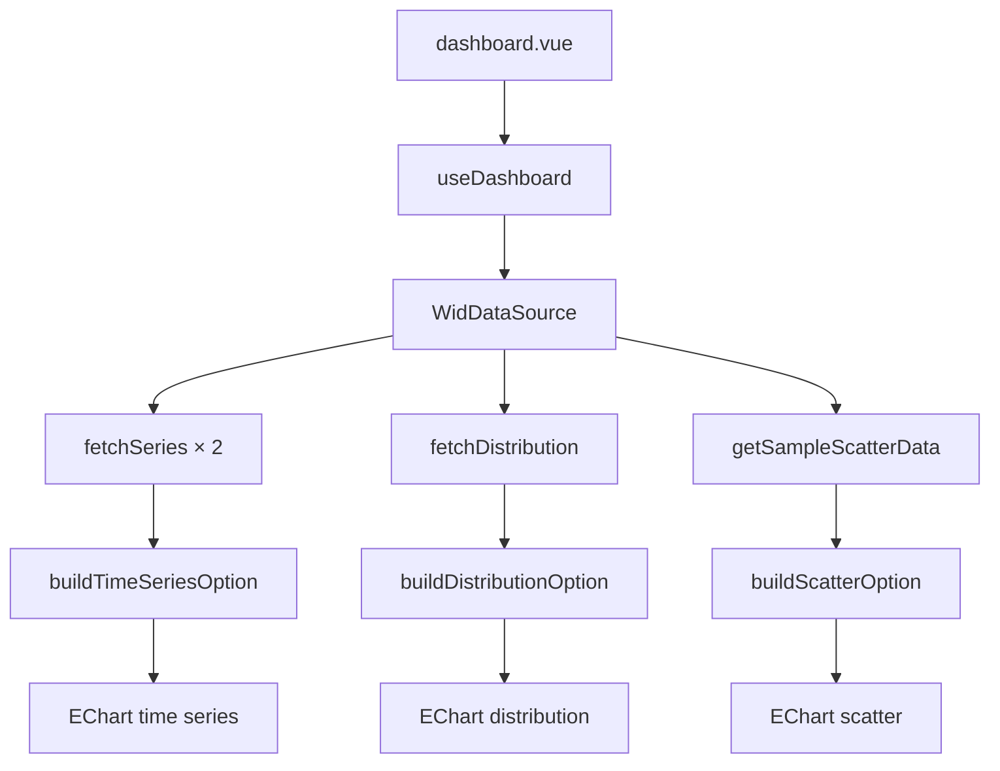

# C — Visualisations

> Catalogue graphique, règles d’échelle, interactions et mapping ECharts/Nuxt.  
> Stack figée : **Nuxt 4 + Vuetify + Apache ECharts** (cf. [decisions.md](./decisions.md), [architecture.md](./architecture.md)).

---

## C1 — Matrice donnée clean → graphique

| Type clean | Graphique | Échelle X | Échelle Y | Interaction MVP | Interaction phase 2 | Priorité |
|------------|-----------|-----------|-----------|-----------------|---------------------|----------|
| `DataSeries` (1 indicateur, 1 pays) | Ligne temporelle | Catégorie années (lin) | Valeur (lin, `scale: true`) | dataZoom slider + inside | brush export | **MVP** |
| `DataSeries` (2 indicateurs, 1 pays) | Ligne multi-série | Années | Valeur | idem | toggle log Y | **MVP** |
| `DistributionSeries` (déciles) | Barres | Catégorie percentile | Valeur | tooltip | — | **MVP** (sample) |
| `DistributionSeries` (fractal 127) | Barres variable width | Lin 0–100 (centile population) | Lin ou **log** revenu/patrimoine | zoom fractal | brush, bascule log-lin | Phase 2 |
| Courbe de Lorenz | Ligne cumulée | Part population (lin) | Part cumulée revenu (lin) | — | comparaison pays | Phase 2 |
| `ScatterPoint[]` (pays × indicateur) | Nuage de points | Indicateur X | Indicateur Y | tooltip label | régression OLS overlay | **MVP** |
| Matrice pays × indicateur | Heatmap | — | — | — | drill-down | Phase 2 |
| Histogramme réciproque | Barres / ligne | — | — | — | — | Phase 2 (A Faire) |

### Règles d’échelle lin / log

Exigence `A Faire.txt` : courbes richesse/revenu vs population ou centile — **plusieurs représentations en mixant log et lin**.

| Contexte | Abscisse (X) | Ordonnée (Y) | Règle |
|----------|--------------|--------------|-------|
| Série temporelle inégalité | Années — **lin** | Parts, Gini — **lin** | Défaut MVP `timeSeries.ts` |
| Distribution par centile (vue globale) | Centile population 0–100 — **lin** | Revenu/patrimoine — **lin** ou **log** | Log Y recommandé si ratio max/min > 100 |
| Zoom fractal top 1 % | Centile 99–100 — **lin** (décimales) | Patrimoine — **log** optionnel | Aligné `zoom_fractal.py` (Y log commenté L93) |
| Régression p50–p90 | log(centile rank) ou log(part population) — **log** | Revenu/patrimoine — **lin** | Spec [D-statistics.md](./D-statistics.md) |
| Scatter macro | Les deux **lin** avec `scale: true` | Idem | Défaut MVP `scatter.ts` |

**UI phase 2 :** toggle « Lin / Log » sur Y (distribution) et X (régression) — état persisté dans query params.

### Zoom fractal / interactions

Référence prototype : `Stage_gscop/zoom_fractal.py` + HTML Plotly.

| Interaction | Comportement cible ECharts | Statut |
|-------------|---------------------------|--------|
| **Zoom fractal** | Barres `width` variable + `xPosition` ; dataZoom sur [99, 100] révèle sous-tranches | Phase 2 |
| **Brush** | Sélection plage centiles → stats D (régression) | Phase 2 |
| **Bascule log-lin** | `yAxis.type: 'value' \| 'log'` | Phase 2 |
| **dataZoom temporel** | Déjà dans `buildTimeSeriesOption` | **MVP** |
| **Vision globale zoomable** | Navigation 0–100 puis drill-in top % | Phase 2 — valeur ajoutée projet |

### Sorties, accessibilité, citation

| Exigence | MVP | Cible |
|----------|-----|-------|
| Export PNG | ECharts toolbox `saveAsImage` (`timeSeries.ts`) | Étendre à distribution + scatter |
| Export SVG | Phase 2 | vectoriel pour rapport |
| Légendes | Multi-série temporelle | Toutes vues |
| Citation source | `provenance.sourceUrl` sous graphique | Page Sources + footer chart |
| Accessibilité | Titres ECharts ; couleurs palette fixe | `aria-label` sur conteneur chart, contraste WCAG |
| i18n | EN (UI actuelle) | FR/EN phase 2 |

---

## C2 — Stack et mapping modules

### Stack figée

| Couche | Choix | Rejeté / reporté |
|--------|-------|------------------|
| Framework | **Nuxt 4** | Next.js (mention A Faire — non retenu, cf. BASE.md) |
| UI | Vuetify 3 | — |
| Charts | **Apache ECharts** via composant `EChart` | Plotly en prod (reste en Python proto) |
| Langage | TypeScript | — |
| Déploiement | Static `nuxt generate` | SSR dynamique |

### Mapping fonction → fichier

| Fonction / vue | Fichier | Entrée clean | Type ECharts |
|----------------|---------|--------------|--------------|
| `buildTimeSeriesOption` | `webapp/src/charts/timeSeries.ts` | `DataSeries[]` | `line` + `dataZoom` |
| `buildDistributionOption` | `webapp/src/charts/distribution.ts` | `DistributionSeries` | `bar` |
| `buildScatterOption` | `webapp/src/charts/scatter.ts` | `ScatterPoint[]` | `scatter` |
| Dashboard (composition) | `webapp/app/pages/dashboard.vue` | via `useDashboard()` | 3× EChart |
| Composable données | `webapp/app/composables/useDashboard.ts` | `WidDataSource` | — |
| Composable sources | `webapp/app/composables/useDataSources.ts` | registry | — |
| Plugin charts | `webapp/app/plugins/` (EChart wrapper) | — | — |
| Hypothèse → charts | `webapp/src/hypotheses/stressHypothesis.ts` | config titres / indicateurs | — |
| Page sources | `webapp/app/pages/sources.vue` | métadonnées sources | — |

### Flux dashboard (MVP)

### Extensions phase 2 (fichiers cibles)

| Graphique | Nouveau module |
|-----------|----------------|
| Distribution fractale | `webapp/src/charts/fractalDistribution.ts` |
| Lorenz | `webapp/src/charts/lorenz.ts` |
| Régression overlay | `webapp/src/charts/regressionOverlay.ts` |
| Heatmap | `webapp/src/charts/heatmap.ts` |

---

## Critères d’acceptation C (MVP)

- [ ] Les 3 builders ECharts acceptent les types clean B1 sans cast ad hoc
- [ ] Time series : zoom temporel fonctionnel
- [ ] Distribution : percentiles ordonnés ; tooltip percentile + valeur
- [ ] Scatter : label pays au survol
- [ ] Chaque chart affiche ou prévoit `provenance` / mention WID

---

## Liens

- Schémas clean → [B-clean-formats.md](./B-clean-formats.md)
- Régression sur graphiques → [D-statistics.md](./D-statistics.md)
- Architecture → [architecture.md](./architecture.md)
