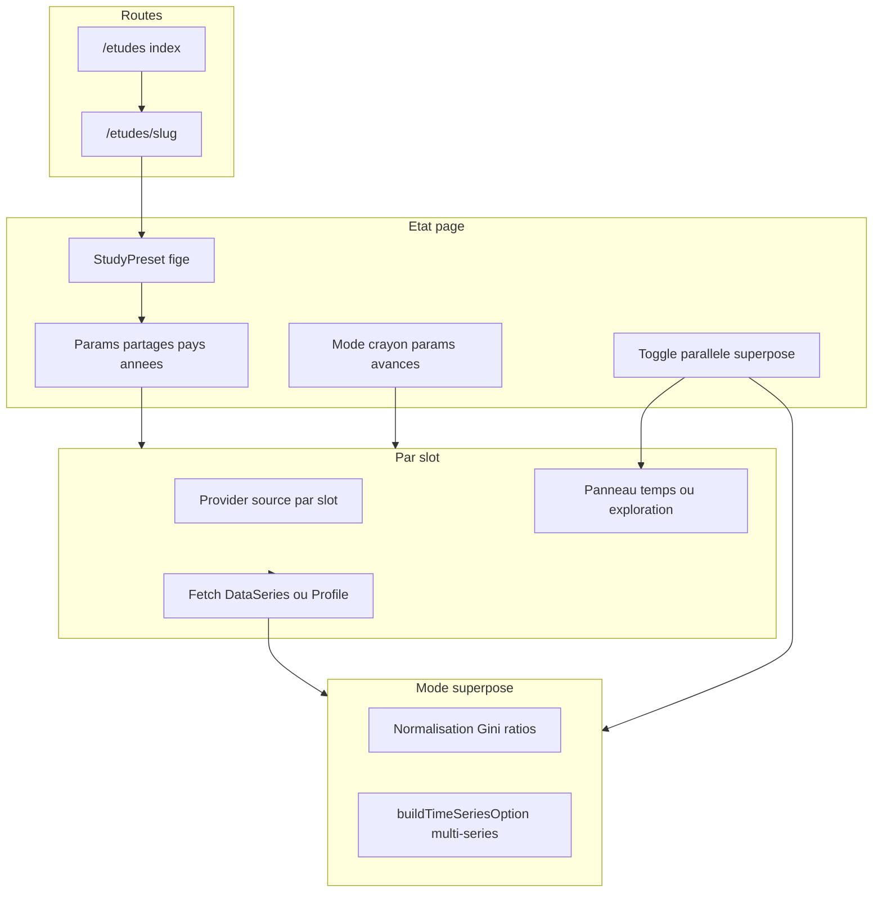

# Études comparatives — Structure UI et architecture

*Spécification produit et contrat technique pour la future page `/etudes` — presets, modes parallèle / superposé, édition masquée.*

Catalogue des cas : [cas-comparaison.md](./cas-comparaison.md).  
Implémentation traceurs : [C2 — Représentation graphique](../C2-representation-graphique/implementation.md).

---

## Vue d’ensemble

| Page | Rôle |
|------|------|
| `/etudes` | Index : cartes des études (titre, question, tier, tags concepts) |
| `/etudes/[slug]` | Une étude : presets, graphiques parallèles ou superposés, édition crayon |

**Différence vs `/grille` :** presets guidés et superposition cross-source ; `/grille` permet source unique ou source par graphique, composition libre.  
**Différence vs `/panneau` :** une source, exploration unitaire.  
**Études :** **une source par slot**, presets guidés, comparaison cross-source assumée.

---

## Architecture (cible)



### Contrainte technique actuelle

[`usePanneauDataSourceProvider`](../../../webapp/app/composables/usePanneauDataSource.ts) ne fournit qu’**une source par page** (clé `Symbol` unique).

**Solution :** composant **`StudySlotShell`** par slot, imbriquant :

1. `usePanneauDataSourceProvider(slot.sourceId)` — source figée ou modifiable en mode crayon ;
2. `useCountriesProvider()` — pays du slot ;
3. Panneau enfant avec `show-data-source-section=false` et chip **concept** visible.

### Composants cibles (webapp)

| Composant | Rôle |
|-----------|------|
| `StudyPageHeader` | Titre, question, bandeau caveats, badge tier |
| `StudySharedControls` | Pays, plage d’années (params partagés) |
| `StudyModeToggle` | Parallèle ↔ Superposé |
| `StudyEditDrawer` | Crayon : params avancés par slot, reset preset |
| `StudySlotShell` | Provider imbriqué + wrapper panneau |
| `StudySlotPanel` | `PanneauSerieTemporelle` ou `PanneauExploration` |
| `StudyOverlayChart` | Agrégation multi-sources → `buildTimeSeriesOption` |

### Fichiers domaine cibles

```
webapp/lib/domain/studies/
  studyTypes.ts
  presets/
    gini-marche.ts
    …
    index.ts          → STUDIES[]
```

---

## Modèle de données

### Types (contrat)

```ts
type StudyTier = 'maintenant' | 'bientot'
type StudyDisplayMode = 'parallele' | 'superpose'
type HarmonizeRule = 'gini-0-1' | 'ratio' | 'indice-base-100' | 'interdit'
type SharedParam = 'country' | 'year' | 'yearRange'
type EditableField = 'country' | 'variable' | 'years' | 'age' | 'pop' | 'percentile' | 'welfareType'

interface StudySlot {
  id: string
  label: string              // "WID — pré-impôt"
  sourceId: 'wid' | 'oecd-idd' | 'worldbank'
  panelType: 'temps' | 'exploration'
  conceptTag: string         // affiché en chip
  params: StudySlotParams
  editableFields: EditableField[]
  optional?: boolean         // slot grisé si pays hors couverture
}

interface StudyOverlay {
  enabled: boolean
  harmonize: HarmonizeRule
  slotIds: string[]          // séries à fusionner
}

interface ComparativeStudy {
  id: string
  slug: string
  title: string
  subtitle: string
  question: string
  tier: StudyTier
  prerequisites?: string[]   // si tier = bientot
  caveats: string[]
  defaultCountry: string
  defaultYearFrom?: number
  defaultYearTo?: number
  defaultYear?: number       // profils snapshot
  sharedParams: SharedParam[]
  defaultMode: StudyDisplayMode
  overlay: StudyOverlay
  slots: StudySlot[]
}
```

### Exemple JSON (extrait — `gini-marche`)

```json
{
  "slug": "gini-marche",
  "tier": "maintenant",
  "defaultCountry": "FR",
  "defaultYearFrom": 1990,
  "defaultYearTo": 2022,
  "sharedParams": ["country", "yearRange"],
  "defaultMode": "superpose",
  "overlay": { "enabled": true, "harmonize": "gini-0-1", "slotIds": ["wid", "oecd", "wb"] },
  "slots": [
    {
      "id": "wid",
      "sourceId": "wid",
      "panelType": "temps",
      "conceptTag": "Pré-impôt DINA",
      "params": { "variable": "gptinc", "age": "992", "pop": "j" }
    },
    {
      "id": "oecd",
      "sourceId": "oecd-idd",
      "panelType": "temps",
      "conceptTag": "Revenu marché METH2012",
      "params": { "variable": "INC_MRKT_GINI" }
    },
    {
      "id": "wb",
      "sourceId": "worldbank",
      "panelType": "temps",
      "conceptTag": "PIP — enquête",
      "params": { "variable": "PIP_GINI" }
    }
  ]
}
```

---

## UX transverse

### Niveaux de paramètres

| Niveau | Visibilité | Exemples |
|--------|------------|----------|
| **Public** | Toujours | Pays, plage d’années (propagés via `sharedParams`) |
| **Preset** | Crayon | Variable, tranche, `age`/`pop` WID, indicateur WB |
| **Expert** | Crayon (section repliée) | Échelle log, bornes custom, export |

### Mode crayon

- Icône **crayon** à côté des contrôles partagés ;
- Au clic : panneau latéral ou expansion avec champs `editableFields` par slot ;
- Chip **Modifié** si état ≠ preset ; bouton **Revenir au preset** ;
- Query URL optionnelle : `?country=DE&from=2000&to=2020`.

### Wireframe type (sous-page)

```text
┌─────────────────────────────────────────────────────────────┐
│ [Titre étude]                          [Tier: Disponible] │
│ Question en une ligne                                       │
│ ⚠ Caveats : pré-impôt WID · dispo OCDE · revenu/conso PIP   │
├─────────────────────────────────────────────────────────────┤
│ Pays [FR ▼]   Années [1990 – 2022 ▼]          [✏️ Modifier] │
├─────────────────────────────────────────────────────────────┤
│ Affichage :  ◉ Parallèle   ○ Superposé                       │
├─────────────────────────────────────────────────────────────┤
│  MODE PARALLÈLE                                             │
│  ┌─────────────┐  ┌─────────────┐  ┌─────────────┐          │
│  │ WID         │  │ OECD IDD    │  │ World Bank  │          │
│  │ [Pré-impôt] │  │ [Marché]    │  │ [PIP]       │          │
│  │  graphique  │  │  graphique  │  │  graphique  │          │
│  └─────────────┘  └─────────────┘  └─────────────┘          │
│  OU MODE SUPERPOSÉ                                          │
│  ┌─────────────────────────────────────────────────────┐    │
│  │  Courbe unique — légende : WID · OCDE · WB          │    │
│  └─────────────────────────────────────────────────────┘    │
└─────────────────────────────────────────────────────────────┘
```

### Harmonisation overlay

| Règle | Application |
|-------|-------------|
| `gini-0-1` | WDI `SI.POV.GINI` ÷ 100 ; PIP et OCDE déjà 0–1 |
| `ratio` | Ratios P90/P10, Palma, QSR — pas de conversion |
| `indice-base-100` | Niveaux monétaires — année de base choisie |
| `interdit` | Profils, pauvreté concepts distincts — parallèle only |

---

## Fiches par étude

Gabarit commun : **Identité · Slots · Preset · Modes · Crayon · Limites · Liens cas**.

---

### 1. `gini-marche` — Gini du revenu (angle marché / pré-impôt)

| Champ | Valeur |
|-------|--------|
| **Tier** | Maintenant |
| **Question** | Les trois bases mesurent-elles la même inégalité du revenu avant redistribution ? |
| **Cas liés** | `gini-marche-3way`, `gini-wid-oecd-marche`, `gini-wid-wb` |

**Slots**

| id | Source | Variable | conceptTag |
|----|--------|----------|------------|
| wid | WID | `gptinc` | Pré-impôt DINA |
| oecd | OECD IDD | `INC_MRKT_GINI` | Revenu marché METH2012 |
| wb | World Bank | `PIP_GINI` | PIP — enquête (revenu ou consommation) |

**Preset défaut :** pays `FR` · années `1990–2022` · WID `age=992`, `pop=j`.

**Modes :** défaut **superposé** · parallèle possible.

**Overlay :** oui · `gini-0-1`.

**Crayon :** variable par slot ; `age`/`pop` WID ; pays alternatif (liste OCDE pour les 3 slots).

**Limites :** Brésil etc. → slot OCDE grisé ; WID sans clé API → slot WID en erreur isolée.

---

### 2. `gini-disponible` — Gini post-impôt / enquête

| Champ | Valeur |
|-------|--------|
| **Tier** | Maintenant |
| **Question** | Comment l’inégalité après impôts et transferts diffère-t-elle entre enquêtes OCDE et PIP ? |
| **Cas liés** | `gini-dispense-3way`, `gini-oecd-wb` |

**Slots**

| id | Source | Variable | conceptTag |
|----|--------|----------|------------|
| wid | WID | `gptinc` | Pré-impôt *(référence, écart explicite)* |
| oecd | OECD IDD | `INC_DISP_GINI` | Revenu disponible |
| wb | World Bank | `PIP_GINI` | PIP — enquête |

**Preset défaut :** pays `FR` · `1990–2022`.

**Modes :** défaut **superposé** (OCDE + WB) ; WID en parallèle ou série pointillée « hors concept ».

**Overlay :** oui pour OCDE + WB · WID documenté à part.

**Crayon :** basculer slot WID optional off ; variables dispo / PIP.

---

### 3. `ratios-deciles` — Ratios inter-déciles

| Champ | Valeur |
|-------|--------|
| **Tier** | Maintenant |
| **Question** | P90/P10, P50/P10 et P90/P50 : même ordre de grandeur entre DINA, OCDE et enquêtes ? |
| **Cas liés** | `ratios-deciles-3way`, `ratios-wid-oecd` |

**Slots**

| id | Source | Variable / calcul | conceptTag |
|----|--------|-------------------|------------|
| wid | WID | `tptinc` → ratios p90/p10, p50/p10, p90/p50 | Seuils pré-impôt |
| oecd | OECD IDD | `INC_DISP_DECILE_RATIOS` ou `D9_1`, `D5_1`, `D9_5` | Ratios dispo |
| wb | World Bank | `PIP_DECILE_SHARES` → approx. ou 3 ratios dérivés | Parts décile PIP |

**Preset défaut :** pays `FR` · `2000–2022` · série temporelle par ratio (sous-sélecteur).

**Modes :** défaut **superposé** par ratio · parallèle 3 colonnes.

**Overlay :** oui · `ratio` · caveats pré vs post-impôt.

**Crayon :** ratio actif ; percentile WID de référence.

---

### 4. `extremes-concentration` — Concentration haut / bas

| Champ | Valeur |
|-------|--------|
| **Tier** | Maintenant |
| **Question** | Les extrêmes de la distribution (top / bottom 10 %) se lisent-ils de façon cohérente ? |
| **Cas liés** | `extremes-3way`, `extremes-wid-wb` |

**Slots**

| id | Source | Variable | conceptTag |
|----|--------|----------|------------|
| wid | WID | `sptinc` (exploration, année fixe) — tranches bas / haut | Parts pré-impôt |
| oecd | OECD IDD | `PAL_INC_DISP`, `QR_INC_DISP` (séries temp.) | Palma, QSR dispo |
| wb | World Bank | `SI.DST.FRST.10` + `SI.DST.10TH.10` ou PIP D1/D10 | Extrêmes enquête |

**Preset défaut :** pays `FR` · année snapshot `2019` (profil WID) + séries WDI/OCDE.

**Modes :** défaut **parallèle** (unités hétérogènes : parts vs ratios).

**Overlay :** partiel — Palma/QSR vs parts WB en lecture séparée.

**Crayon :** année snapshot ; choix WDI vs PIP pour slot WB.

---

### 5. `evolution-pays` — Évolution temporelle (même pays)

| Champ | Valeur |
|-------|--------|
| **Tier** | Maintenant |
| **Question** | L’inégalité a-t-elle évolué dans le même sens selon WID, OCDE et PIP ? |
| **Cas liés** | `evolution-3way`, `evolution-wid-wb` |

**Slots**

| id | Source | Variable | conceptTag |
|----|--------|----------|------------|
| wid | WID | `gptinc` | Pré-impôt |
| oecd | OECD IDD | `INC_MRKT_GINI` | Marché |
| wb | World Bank | `PIP_GINI` | PIP |

**Preset défaut :** pays `FR` · `1990–2022` · 3 pays comparables suggérés : FR, DE, US, JP.

**Modes :** défaut **superposé**.

**Overlay :** oui · `gini-0-1`.

**Crayon :** pays ; fenêtre temporelle ; variante OCDE dispo vs marché.

---

### 6. `profil-distributif` — Forme de la distribution (1 année)

| Champ | Valeur |
|-------|--------|
| **Tier** | **Bientôt** |
| **Prérequis** | WB percentiles PIP (100 pts) ; parts décile OCDE |
| **Question** | La courbe de répartition du revenu a-t-elle la même forme ? |
| **Cas liés** | `profil-3way`, `profil-wid-wb` |

**Slots**

| id | Source | Variable | conceptTag |
|----|--------|----------|------------|
| wid | WID | `sptinc` | 127 centiles — parts |
| oecd | OECD IDD | Bundle parts décile *(à implémenter)* | 10 parts dispo |
| wb | World Bank | Percentiles PIP `welfare_share` *(à implémenter)* | 100 points |

**Preset défaut :** pays `FR` · année `2019`.

**Modes :** **parallèle uniquement** · overlay interdit.

**Crayon :** année ; basculer `tptinc` vs `sptinc` WID.

---

### 7. `seuils-revenu` — Seuils aux rangs p10 / p50 / p90

| Champ | Valeur |
|-------|--------|
| **Tier** | **Bientôt** |
| **Prérequis** | PIP percentiles `quantile` ; seuils OCDE D1/D5/D9 |
| **Question** | À rangs comparables, les seuils de revenu divergent-ils ? |
| **Cas liés** | `seuils-wid-wb` |

**Slots**

| id | Source | Variable | conceptTag |
|----|--------|----------|------------|
| wid | WID | `tptinc` | Seuils pré-impôt |
| oecd | OECD IDD | Seuils D1/D5/D9 *(à implémenter)* | Seuils dispo monnaie nat. |
| wb | World Bank | PIP `quantile` p10/p50/p90 *(à implémenter)* | Seuils $ PPP/j |

**Preset défaut :** pays `FR` · année `2019`.

**Modes :** parallèle · overlay **interdit** (unités).

**Crayon :** rangs cibles ; normalisation indice optionnelle (expert).

---

### 8. `pauvrete-concepts` — Pauvreté : concepts distincts

| Champ | Valeur |
|-------|--------|
| **Tier** | Maintenant |
| **Question** | Que mesure la « pauvreté » quand le seuil est relatif (OCDE) vs international (WB) ? |
| **Cas liés** | `pauvrete-3way`, `pauvrete-oecd-wb` |

**Slots**

| id | Source | Variable | conceptTag |
|----|--------|----------|------------|
| wid | — | *(absent)* | WID sans indicateur pauvreté |
| oecd | OECD IDD | `PR_INC_DISP_50` | Sous 50 % médian national |
| wb | World Bank | `PIP_HEADCOUNT` | Seuil 3,65 $/j PPP 2017 |

**Preset défaut :** pays `FR` · `2000–2022` · **2 slots** (pas de WID).

**Modes :** **parallèle uniquement**.

**Overlay :** **interdit**.

**Crayon :** seuil PIP (`povline`) ; pays.

---

### 9. `patrimoine-wid-oecd` — Patrimoine net (WID vs OCDE WDD)

| Champ | Valeur |
|-------|--------|
| **Tier** | **Bientôt** |
| **Prérequis** | Source OECD WDD dans l’app |
| **Question** | L’inégalité de patrimoine est-elle similaire entre comptes DINA et enquêtes OCDE ? |
| **Cas liés** | `patrimoine-wid-oecd`, `gini-patrimoine-wid-oecd` |

**Slots**

| id | Source | Variable | conceptTag |
|----|--------|----------|------------|
| wid | WID | `ghweal`, `shweal` (profil) | Patrimoine net DINA |
| oecd | OECD WDD *(à implémenter)* | Gini / parts patrimoine | Enquête patrimoine OCDE |
| wb | — | — | Non disponible |

**Preset défaut :** pays `FR` · `992/j` · années selon disponibilité WDD.

**Modes :** parallèle profils ; overlay Gini si scalaire WDD.

**Crayon :** variable WID `ahweal` / `ghweal` / `shweal`.

---

### 10. `composition-travail-capital` — Revenu du travail vs capital

| Champ | Valeur |
|-------|--------|
| **Tier** | **Bientôt** |
| **Prérequis** | Composantes revenu OECD IDD (SDMX) |
| **Question** | La part travail / capital dans la distribution diffère-t-elle entre DINA et enquêtes ? |
| **Cas liés** | `composition-wid-oecd` |

**Slots**

| id | Source | Variable | conceptTag |
|----|--------|----------|------------|
| wid | WID | `apllin`, `apkkin` (profils ou p50) | Travail / capital pré-impôt |
| oecd | OECD IDD *(à implémenter)* | Earnings, capital income shares | Composantes dispo |
| wb | — | — | Hors scope |

**Preset défaut :** pays `FR` · année snapshot · 2 slots.

**Modes :** parallèle · overlay interdit.

**Crayon :** paire de variables WID ; composante OCDE.

---

## Index des études

| # | slug | Tier | Mode défaut | Overlay | Slots |
|---|------|------|-------------|---------|-------|
| 1 | `gini-marche` | Maintenant | Superposé | Gini 0–1 | 3 |
| 2 | `gini-disponible` | Maintenant | Superposé | Gini 0–1 | 3 |
| 3 | `ratios-deciles` | Maintenant | Superposé | Ratio | 3 |
| 4 | `extremes-concentration` | Maintenant | Parallèle | Partiel | 3 |
| 5 | `evolution-pays` | Maintenant | Superposé | Gini 0–1 | 3 |
| 6 | `profil-distributif` | Bientôt | Parallèle | Interdit | 3 |
| 7 | `seuils-revenu` | Bientôt | Parallèle | Interdit | 3 |
| 8 | `pauvrete-concepts` | Maintenant | Parallèle | Interdit | 2 |
| 9 | `patrimoine-wid-oecd` | Bientôt | Parallèle | Gini | 2 |
| 10 | `composition-travail-capital` | Bientôt | Parallèle | Interdit | 2 |

**Pour ajouter une étude :** copier une fiche ci-dessus, assigner un `slug` unique, référencer les `id` de [cas-comparaison.md](./cas-comparaison.md), définir tier et overlay.

---

## Navigation (future)

Entrée drawer : **Études comparées** → `/etudes`.

Carte index :

- Titre + question ;
- Badges sources (WID · OCDE · WB) ;
- Tier : **Disponible** / **Bientôt** ;
- Lien `/etudes/[slug]`.

---

[Cas de comparaison](./cas-comparaison.md) · [C3 — Interactions](../C3-interactions.md) · [A4 — Caractérisation](../../A-raw-data/A4-caracterisation.md)
