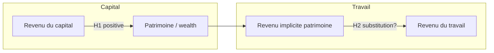
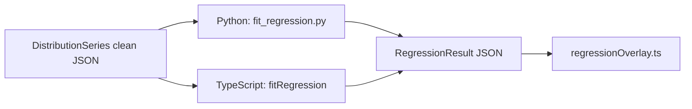

# D — Statistiques et ML

> Analyses mathématiques, hypothèses testables, contexte d’exécution et formats de sortie.  
> Références : `A Faire.txt` (régression p50–p90, relations capital/patrimoine/travail), `stressHypothesis.ts`.

---

## D1 — Analyses

### Catalogue

| Analyse | Entrées | Sortie | MVP / Phase 2 | Notes |
|---------|---------|--------|---------------|-------|
| Corrélation Pearson | 2× `DataSeries` alignées par année | `r`, `p-value`, `n` | Phase 2 | Pays ou panel |
| Corrélation Spearman | 2× `DataSeries` | `rho`, `p-value`, `n` | Phase 2 | Robuste aux outliers |
| Régression linéaire OLS (séries temporelles) | `DataSeries` Y ~ `DataSeries` X | `RegressionResult` | Phase 2 | Fenêtre `yearFrom`–`yearTo` |
| **Régression centiles p50–p90** | `DistributionSeries`, abscisse **log** | `RegressionResult` | **Priorité phase 2** | Exigence A Faire |
| Test de tendance (Mann-Kendall) | `DataSeries` | stat, p-value | Phase 2 | Évolution inégalité |
| Détection de ruptures | `DataSeries` | dates candidate break | Phase 2 | Exploratoire |
| Régression scatter pays | `ScatterPoint[]` | droite OLS + R² | Phase 2 | Overlay sur `scatter.ts` |

### Régression p50–p90 (spécification détaillée)

Exigence `A Faire.txt` : *« droite de régression linéaire sur les données pour une plage de centile bien choisie (entre p50 et p90) pour les graphes avec l'abscisse en log »*.

| Paramètre | Valeur |
|-----------|--------|
| Plage centiles | `p50p51` … `p89p90` (ou équivalent décile/centile WID dans l’intervalle [50, 90]) |
| Abscisse X | log(rank population cumulé) ou log(midpoint centile) |
| Ordonnée Y | Revenu ou patrimoine moyen (valeur WID) |
| Modèle | `Y = α + β·log(X)` — OLS |
| Sorties | `slope`, `intercept`, `rSquared`, `standardError`, `pointCount`, plage |
| Visualisation | Overlay sur graphique distribution fractale — [C-visualizations.md](./C-visualizations.md) |

Prototype de référence : étendre la logique de `Stage_gscop/zoom_fractal.py` (filtrage percentiles) + module stats Python ou `simple-statistics` côté TS.

---

## Hypothèses testables

### H0 — Stress vs inégalité (existant, sample-only)

| Champ | Valeur |
|-------|--------|
| **Id** | `stress-inequality-correlation` |
| **Fichier** | `webapp/src/hypotheses/stressHypothesis.ts` |
| **Variables** | X : `sptinc` (Top 10 % income share) ; Y : `stress_index` (proxy sample) |
| **Relation attendue** | Positive |
| **Pays / fenêtre** | Tous pays MVP ; 1980–2023 |
| **Critère validation** | Pearson r > 0, p < 0.05 sur panel — **non applicable MVP** (Y fictif) |
| **Statut** | Démo UX uniquement — [decisions.md §6](./decisions.md) |

### H1 — Revenu du capital et patrimoine (documentée, phase 2)

| Champ | Valeur |
|-------|--------|
| **Id** | `capital-income-wealth` *(à créer)* |
| **Variables** | X : part revenu du capital WID (`cshinc*` ou proxy) ; Y : patrimoine moyen `ahwbus` ou percentile patrimoine |
| **Relation attendue** | Positive — concentration patrimoniale associée à part revenu capital plus élevée |
| **Pays** | FR, US, DE (+ panel MVP) |
| **Fenêtre** | 1995–2023 (disponibilité patrimoine) |
| **Critère** | Spearman ρ > 0.3 sur panel ; courbe cohérente par pays |
| **Source A Faire** | *« Mettre en relation les revenus du capital et le patrimoine »* |

### H2 — Revenu du patrimoine vs revenu du travail (documentée, phase 2)

| Champ | Valeur |
|-------|--------|
| **Id** | `wealth-income-vs-labor` *(à créer)* |
| **Variables** | X : revenu implicite du patrimoine (ratio revenu capital / patrimoine ou série WID dédiée) ; Y : revenu du travail moyen ou part salaires |
| **Relation attendue** | Substitution partielle — à affiner selon séries WID disponibles |
| **Pays** | FR, US |
| **Fenêtre** | 2000–2023 |
| **Critère** | Régression panel documentée ; sensibilité pré/post crise 2008 |
| **Source A Faire** | *« revenus du patrimoine et ceux du travail »* |

### H3 — Pente top centiles (régression p50–p90)

| Champ | Valeur |
|-------|--------|
| **Id** | `percentile-slope-p50-p90` |
| **Variables** | X : log(centile) ; Y : patrimoine `thwealj992` |
| **Relation attendue** | β > 0 ; comparaison β entre pays |
| **Pays** | FR (pilote), US, CN |
| **Années** | Coupe transversale 2019, 2024 |
| **Critère** | β_FR vs β_US statistiquement différent (bootstrap phase 2) |

---

## Relations économiques à documenter



| Relation | Type | Données WID requises | Statut |
|----------|------|----------------------|--------|
| Revenu capital ↔ patrimoine | Corrélation / panel | `cshinc*`, `ahwbus`, `thwealj992` | Spec H1 |
| Revenu patrimoine ↔ travail | Régression | Composition revenu + patrimoine | Spec H2 |
| Inégalité ↔ stress social | Corrélation | `sptinc` + source externe | Hors MVP (H0 sample) |

---

## D2 — Contexte d’exécution

| Analyse | Exécuteur | Justification | Limites |
|---------|-----------|---------------|---------|
| Agrégation dashboard, cache | **Client** (navigateur) | Déjà `WidDataSource` + composables | Taille panel MVP OK |
| Corrélation / OLS séries | **Client** (lib légère) ou **Worker** phase 2 | < 10³ points | Éviter bloquer UI |
| Régression p50–p90 | **Python offline** puis **Client** phase 2 | Proto Python ; validation numérique | 127 points × 8 pays OK client |
| Tests statistiques lourds (bootstrap, breaks) | **Python** `scripts/stats/` | Reproductibilité notebooks | Hors chemin critique UI |
| ML exploratoire | **Python** | Hors MVP | — |

### Pipeline stats (phase 2)



---

## Type `RegressionResult` (esquisse)

```typescript
// webapp/src/domain/stats.ts — à créer

export interface RegressionResult {
  id: string
  model: 'ols-linear' | 'ols-log-x'
  dependentLabel: string
  independentLabel: string
  countryCode?: string
  year?: number
  percentileRange?: { from: string; to: string }  // ex. p50p51 → p89p90
  slope: number
  intercept: number
  rSquared: number
  standardError?: number
  pointCount: number
  pValue?: number
  points: { x: number; y: number; fitted: number }[]
  metadata?: {
    computedAt: string
    executor: 'client' | 'python'
    schemaVersion: string
  }
}
```

Extension possible : `CorrelationResult`, `TrendTestResult` — même fichier, `schemaVersion` aligné B1.

---

## Critères d’acceptation D

### MVP (documentation)

- [x] H0 documentée avec statut sample-only
- [x] H1, H2, H3 formalisées avec variables et critères
- [x] Régression p50–p90 spécifiée (entrées/sorties)
- [x] `RegressionResult` esquissé

### Phase 2 (implémentation)

- [ ] Module stats TS ou script Python produit `RegressionResult` depuis `DistributionSeries`
- [ ] Overlay régression sur graphique fractal
- [ ] H1 testable avec vraies séries WID composition revenu

---

## Liens

- Données entrée → [B-clean-formats.md](./B-clean-formats.md)
- Rendu graphique → [C-visualizations.md](./C-visualizations.md)
- Modèles économiques → [E-economic-models.md](./E-economic-models.md)
