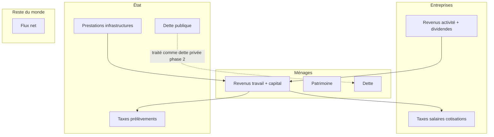

# E — Modèles économiques

> Périmètre phase 1 (documentation) vs phase 2 (implémentation).  
> Aligné sur `A Faire.txt` : *« On ne va prendre aucun modèle, mais partir sur des observations à partir des données du WIR »*.

---

## Principe directeur

| Phase | Objectif | Implémentation code |
|-------|----------|-------------------|
| **Phase 1 (actuelle)** | Documentation bibliographique, fiches conceptuelles, liens vers visus WID | **Aucun** solveur DSGE, SFC ou éconophysique |
| **Phase 2** | Prototype pédagogique SFC minimal, éventuellement modules calibrés | Roadmap ci-dessous |

Les blocs E1–E3 de [General.md](./General.md) sont traités ici comme **cadre théorique**, pas comme backlog d’implémentation immédiat.

---

## E1 — Éconophysique

### Phase 1 — documentation

| Livrable | Contenu |
|----------|---------|
| Fiche conceptuelle | Lois de puissance, distributions à queue lourde appliquées à revenu/patrimoine |
| Lien données | Séries WID percentile → validation empirique (graphiques C, stats D) |
| Références | Bibliographie dans `notes/lectures/` — hors implémentation simulateur |
| Lien visus | Distribution fractale comme **observation**, pas simulation agent-based |

### Phase 2 — roadmap

- Comparaison empirique (WID) vs loi de Pareto / log-normale sur tranche p90–p100
- Éventuel notebook Python — pas d’intégration UI obligatoire

### Données d’entrée requises (futur)

- `DistributionSeries` fractal WID (`thwealj992`, séries revenu)
- Paramètres : pays, année, concept pré/post tax

### Sorties attendues (futur)

- Paramètres de fit (exposant α), graphique overlay
- Pas de prévision macro

---

## E2 — Stock-Flow Consistency (SFC)

### Questions ouvertes (A Faire.txt)

| Question | Traitement phase 1 |
|----------|-------------------|
| Balance sectorielle public / privé | Schéma comptable annoté (diagramme ci-dessous) |
| Dette publique = dette privée ; État comme entité | Note méthodologique : perspective comptable **horizontaliste** / SFC — pas de prise de position normative chiffrée |
| Raffinements sectoriels | Liste des comptes cibles pour phase 2 |

### Données d’entrée requises (phase 2)

| Agrégat | Source potentielle | Lien WID MVP |
|---------|-------------------|--------------|
| Revenus État : taxes, impôts | Comptabilité nationale, WIR | ❌ — à ingérer A2 phase 2 |
| Dépenses État : prestations, infra | Idem | ❌ |
| Revenus entreprises : aides, activité, dividendes | WID partiel + CN | ❌ |
| Dépenses entreprises : taxes, salaires, cotisations | CN | ❌ |
| Patrimoine / revenu ménages | WID | ✅ MVP |

### Phase 1 — livrables « done »

- [x] Fiche SFC : secteurs, flux principaux, question dette publique documentée
- [x] Lien explicite vers indicateurs WID observables (revenu, patrimoine) — pas de matrice chiffrée
- [ ] **1 graphique illustratif** : série temporelle WID (ex. `sptinc`) annotée « observation compatible comptabilité ménages » — **sans solveur**
- [ ] Références bibliographiques (Godley & Lavoie, etc.) dans `notes/lectures/`

### Phase 2 — roadmap

| Étape | Description |
|-------|-------------|
| SFC minimal | 4 secteurs, matrice de flux annuelle, pas de dynamique prix |
| Calibration | Alignement ordres de grandeur WID + CN pour 1 pays (FR) |
| Visualisation | Sankey ou tableau flux — nouveau module C |
| Dette | Poste explicite État ↔ ménages / banques selon convention choisie |

---

## E3 — DSGE (Dynamic Stochastic General Equilibrium)

### Phase 1

| Livrable | Statut |
|----------|--------|
| Fiche comparative DSGE vs SFC vs approche purement empirique WID | À rédiger dans `notes/` |
| Position projet | **Non retenu** pour le stage — observations WID prioritaires |
| Lien visus | Aucun — DSGE n’alimente pas les graphiques MVP |

### Phase 2

- Uniquement si extension post-stage : lien possible via paramètres calibrés sur moments WID (part capital, Gini) — **hors scope actuel**.

---

## Synthèse des familles

| Famille | Phase 1 | Phase 2 | Données WID MVP |
|---------|---------|---------|-----------------|
| Éconophysique | Doc + fit empirique optionnel | Notebooks | Distribution percentile |
| SFC | Schéma + 1 graphique observ. | Matrice minimale FR | Revenu, patrimoine |
| DSGE | Fiche comparative | Non planifié | — |

---

## Critère « done » phase 1 (bloc E)

1. Ce document et [decisions.md §5](./decisions.md) approuvés  
2. Schéma sectoriel SFC (mermaid ci-dessus) repris ou enrichi dans le rapport  
3. Au moins **une** fiche de lecture modèle (SFC ou éconophysique) dans `notes/lectures/`  
4. Aucun code solveur DSGE/SFC dans le dépôt `samuel-gscop-26/`  
5. Dashboard MVP reste **observation-first** (WID → clean → visus)

---

## Liens

- Statistiques sur observations → [D-statistics.md](./D-statistics.md)
- Sources macro futures → [A-raw-data.md](./A-raw-data.md) (phase 2)
- Workflow global → [architecture.md](./architecture.md)
