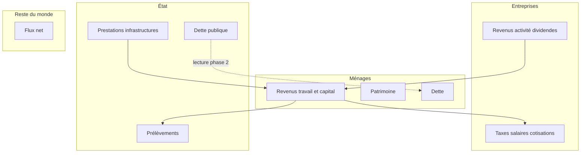

# E2 — Stock-Flow Consistency (SFC)

*Relier ménages, entreprises, État et reste du monde.*

## Questions ouvertes (phase 1 — documenter, pas chiffrer)

| Question | Traitement |
|----------|------------|
| Balance public / privé | Schéma comptable annoté |
| Dette publique, rôle de l’État | Note SFC / horizontaliste — pas de position normative chiffrée |
| Secteurs détaillés | Comptes cibles pour phase 2 |

## Données (phase 2)

| Agrégat | Type de source | Couverture MVP |
|---------|----------------|----------------|
| État (recettes, dépenses) | Comptabilité nationale, flux publics — [A2 catalogue](../A-raw-data/A2-sources/catalogue-sources.md) | Macro sectorielle |
| Entreprises | Comptabilité nationale + sources sectorielles | Partielle |
| Ménages (revenu, patrimoine) | Séries et distributions distributives (B1 **Série** / **Distribution**) | **Oui** — pilier empirique |

## Livrables phase 1

- Schéma sectoriel pour le rapport
- Les données ménages = **observations** empiriques, pas matrice SFC complète
- Un graphique d’observation annoté « lecture comptabilité ménages » — sans solveur
- Fiche de lecture (Godley & Lavoie ou équivalent)

## Intention phase 2

| Étape | Contenu |
|-------|---------|
| SFC minimal | 4 secteurs, flux annuels, pas de dynamique des prix |
| Calibration | Agrégats sectoriels + données distributives ménages (sources caractérisées [A4](../A-raw-data/A4-caracterisation.md)) |
| Visualisation | Sankey ou tableau — [C](../C-visualizations/) |
| Dette | Convention explicite État ↔ ménages / banques |

