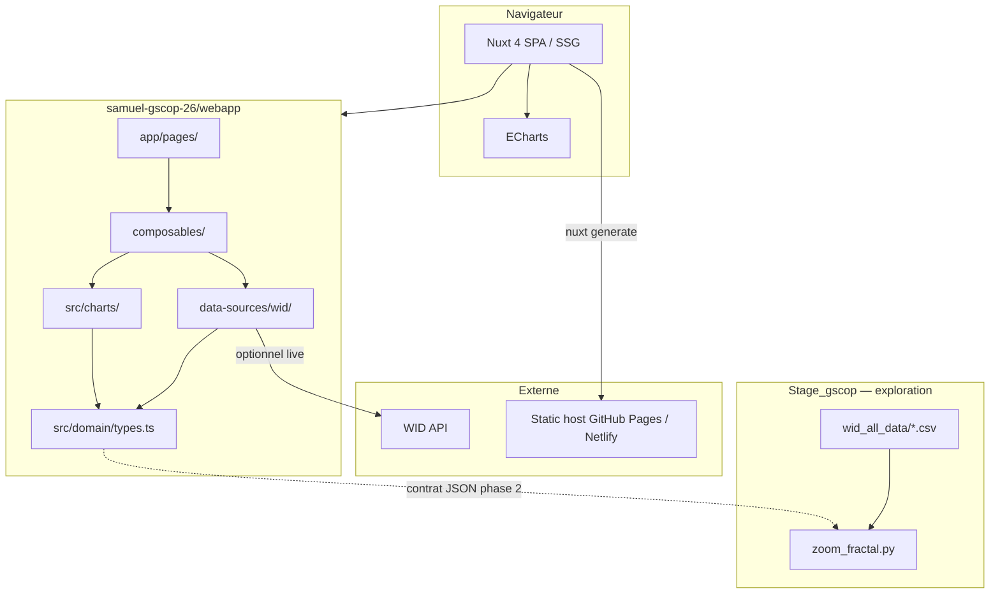

# Architecture

> Stack technique, déploiement, lien webapp ↔ scripts Python, sécurité et traçabilité.

---

## Vue d’ensemble



---

## Stack

| Couche | Technologie | Référence |
|--------|-------------|------------|
| Framework | Nuxt 4 | [BASE.md](../BASE.md), `webapp/package.json` |
| UI | Vuetify 3 | `webapp/app/plugins/vuetify.client.ts` |
| Langage | TypeScript | `webapp/src/` |
| Graphiques | Apache ECharts | `webapp/src/charts/` |
| HTTP | `fetchJson` | `webapp/src/http/fetchJson.ts` |
| Données | WID.world adapter | `webapp/src/data-sources/wid/` |
| Exploration | Python 3 + pandas + Plotly | `Stage_gscop/zoom_fractal.py` |
| Spec | Markdown A–E | `samuel-gscop-26/spec/` |

**Choix rejetés MVP :** Next.js, backend FastAPI dédié, Plotly en production front (reste prototype Python).

---

## Déploiement

### Build statique

```bash
cd samuel-gscop-26/webapp
npm install
npm run generate
```

| Sortie | Usage |
|--------|-------|
| `.output/public/` | Artefacts HTML/JS/CSS statiques |
| Hébergeurs | GitHub Pages, Netlify, Cloudflare Pages |

### Variables d’environnement

Fichier : `webapp/.env.example`

| Variable | Rôle |
|----------|------|
| `NUXT_PUBLIC_WID_API_KEY` | Clé API WID (optionnelle) |
| `NUXT_PUBLIC_WID_API_BASE_URL` | Base URL API |

**Sans clé :** `WidDataSource` bascule sur `sampleData.ts` — site entièrement statique et offline-capable après build.

### CI (recommandé phase 2)

1. `npm run build` ou `generate`
2. Tests fixtures WID → clean
3. Déploiement artefact `.output/public`

---

## Webapp ↔ scripts Python

| Aspect | Webapp (TS) | Python |
|--------|-------------|--------|
| Rôle | Pipeline production Raw→Clean, UI | Exploration, zoom fractal, stats lourdes |
| Entrée | WID API / CSV upload | CSV bulk `wid_all_data/` |
| Sortie | Types clean B1 en mémoire | HTML Plotly, futur JSON stats |
| Partage | Contrat `WidDataRow` / `DistributionSeries` | Export JSON aligné schéma B1 |

**Workflow développeur :**

1. Prototyper viz/stats en Python (`zoom_fractal.py`)
2. Porter logique percentile + régression vers TypeScript si validé
3. Documenter écarts dans [B-clean-formats.md](./B-clean-formats.md)

Pas de dépendance runtime Node → Python en MVP.

---

## Sécurité — clés API

| Règle | Détail |
|-------|--------|
| **Ne jamais committer** | `.env` gitignoré ; seul `.env.example` versionné |
| **Préfixe `NUXT_PUBLIC_`** | Exposé au bundle client — acceptable pour clé demo WID |
| **Rotation** | Regénérer clé si fuite ; documenter dans README |
| **Proxy serveur** | Phase 2 si secretisation requise — route Nuxt server ou edge function |
| **CORS** | Appels directs API WID depuis navigateur ; gérer erreurs dans `widSource.ts` |

---

## Traçabilité

Chaque point affiché doit pouvoir référencer :

| Champ | Source |
|-------|--------|
| `sourceId` | ex. `wid` |
| `indicatorId` | ex. `sptinc` |
| `vintage` | Date snapshot CSV ou fetch |
| `sourceUrl` | Lien WID graphing tool ou API query |
| `retrievedAt` | ISO timestamp dernier fetch |
| `metadata.sample` | `true` si fixture |

**État actuel :** partiel — `metadata.sample` présent ; `provenance` complet prévu B1.

**UI cible :** footer sous chaque chart + page `app/pages/sources.vue` alignée sur [A-raw-data.md](./A-raw-data.md).

---

## Non-fonctionnel

| Thème | MVP | Phase 2 |
|-------|-----|---------|
| Perf CSV upload | < 5 Mo, parsing sync | Web Worker |
| Offline | Sample data post-build | Service worker |
| i18n | EN | FR/EN |
| Accessibilité | Titres charts | aria-label, contraste |
| Licence redistribution | Attribution WID visible | Fichier `LICENSE-DATA.md` |

---

## Glossaire (extrait)

| Terme | Définition |
|-------|------------|
| **WID code** | Identifiant variable World Inequality Database (ex. `sptinc`, `thwealj992`) |
| **Centile / percentile** | Part de population en dessous d’un seuil ; notation WID `p50p51` = tranche 50–51 % |
| **Part (share)** | Fraction du total national (ex. top 10 % income share) |
| **Gini** | Indice de dispersion 0 (égalité) à 1 (inégalité max) |
| **PPP** | Parité de pouvoir d’achat — euros internationalisés |
| **DINA** | Distributional National Accounts — méthodologie WID |
| **Fractal zoom** | Raffinement progressif des tranches percentile top 1 % / 0.1 % / 0.01 % |
| **Clean** | Données normalisées selon schéma B1, prêtes pour visus/stats |
| **Vintage** | Date de capture ou version d’un snapshot de données |

Dictionnaire complet WID : https://wid.world/codes-dictionary/#using-graphing

---

## Workflow BARZOLA-POMA-HILD (2023)

Référence citée dans `A Faire.txt` — workflow données / algorithmes / visualisation (document archivage, p. 26). Résumé opérationnel pour ce projet :

| Étape | Rôle projet | Artefact |
|-------|-------------|----------|
| **1. Acquisition** | Inventaire sources A2, fetch WID | `widClient.ts`, CSV snapshots |
| **2. Documentation raw** | Formats, sémantique codes | [A-raw-data.md](./A-raw-data.md) |
| **3. Transformation clean** | Pipeline ordonné, validation | [B-clean-formats.md](./B-clean-formats.md) |
| **4. Analyse** | Stats, hypothèses | [D-statistics.md](./D-statistics.md) |
| **5. Visualisation** | Mapping clean → chart | [C-visualizations.md](./C-visualizations.md) |
| **6. Interprétation** | Modèles, contexte théorique | [E-economic-models.md](./E-economic-models.md) |

Les rôles Raw / Clean / Viz du workflow académique correspondent aux blocs **A → B → C** de la spec ; D et E prolongent analyse et interprétation sans imposer de solveur macro.

---

## Structure dépôt

```
samuel-gscop-26/
├── BASE.md                 # Stack initiale (Nuxt, TS, ECharts)
├── spec/                   # Spec A–E (ce dossier)
│   ├── General.md          # Index
│   ├── decisions.md
│   ├── A-raw-data.md
│   ├── B-clean-formats.md
│   ├── C-visualizations.md
│   ├── D-statistics.md
│   ├── E-economic-models.md
│   └── architecture.md     # Ce fichier
└── webapp/                 # Application Nuxt
    ├── app/
    └── src/
```

Scripts Python de recherche : `Stage_gscop/` (repo parent stage), hors `samuel-gscop-26/` strict mais liés par contrat de données.

---

## Liens

- Décisions verrouillées → [decisions.md](./decisions.md)
- Index spec → [General.md](./General.md)
