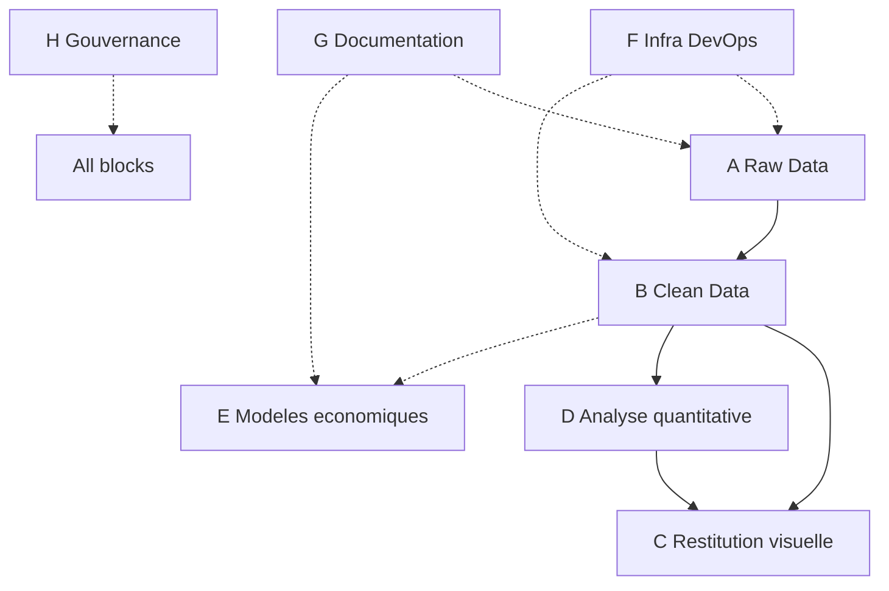
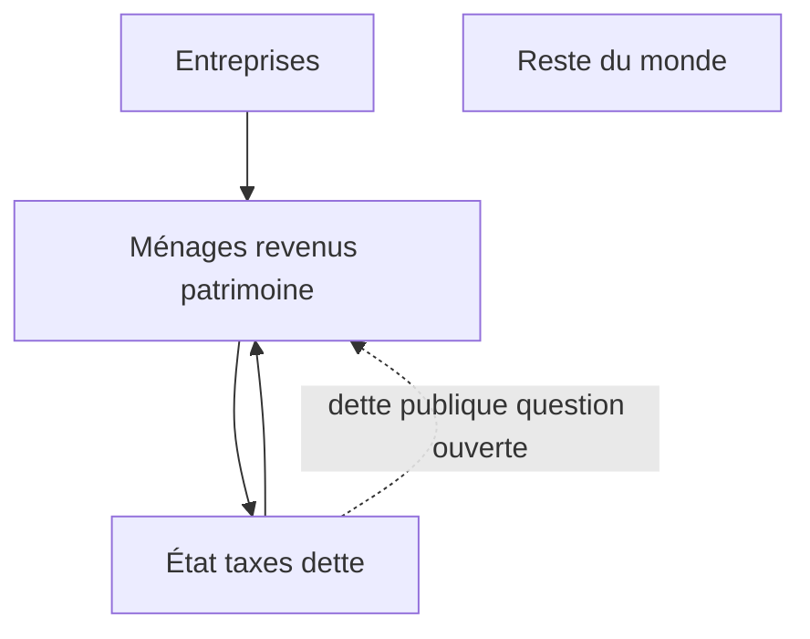

# Spécifications générales du projet — spec_2 (v2)

> Document **consolidé** : pipeline A → H, décisions verrouillées, sources de données, phasage MVP/P2/P3, critères d’acceptation et lien avec le code existant.  
> Dépôt spec : `samuel-gscop-26/spec/` — fichiers détaillés par bloc en fin de document.

---

## Table des matières

0. [Cadrage exécutif](#0-cadrage-exécutif)  
1. [Vue d’ensemble A → H](#1-vue-densemble-a--h)  
2. [Décisions de projet](#2-décisions-de-projet)  
3. [A — Raw Data](#a--raw-data-acquisition--stratégie)  
4. [B — Clean Data](#b--clean-data-ingénierie--modélisation)  
5. [C — Restitution visuelle](#c--restitution-visuelle-exploration--publication)  
6. [D — Analyse quantitative](#d--analyse-quantitative-stats--ml)  
7. [E — Modèles économiques](#e--modèles-économiques)  
8. [F — Infrastructure & orchestration](#f--infrastructure--orchestration-devops)  
9. [G — Restitution documentaire](#g--restitution-documentaire)  
10. [H — Gouvernance et limites](#h--gouvernance-et-limites)  
11. [Feuille de route](#11-feuille-de-route)  
12. [Critères d’acceptation globaux](#12-critères-dacceptation-globaux)  
13. [Annexes & liens](#13-annexes--liens)

---

## 0. Cadrage exécutif

### 0.1 Objectif

Construire une **plateforme d’exploration** des inégalités économiques (revenus, patrimoines ; extensions énergie / carbone en phase 2) avec :

- un pipeline **reproductible** Raw → Clean → Visu → Stats ;
- une **vision globale zoomable** sur les distributions WID (percentiles fractals) ;
- une interprétation macro **documentée** (SFC, éconophysique) **sans prétendre** rivaliser avec des modèles calibrés de la littérature.

Aligné sur `A Faire.txt` : *« On ne va prendre aucun modèle, mais partir sur des observations à partir des données du WIR/WID. »*

### 0.2 Périmètre par phase

| Phase | Contenu | Hors scope |
|-------|---------|------------|
| **MVP (stage T1)** | WID, 8 pays, dashboard Nuxt, proto Python/fractal-web, spec A–H | DSGE calibré, chocs policy, data lake distribué |
| **P2** | Fractal 127 pts réel, régression p50–p90, CSV `vintage`, HBS/Insee, Lorenz | Solveur SFC complet |
| **P3 (recherche)** | Matrice SFC minimale FR, carbone ménages unifié, pipelines automatisés | Production SaaS |

### 0.3 Positionnement scientifique

Par rapport aux 50+ chercheurs sur l’inégalité (WID/WIR), la valeur ajoutée visée :

1. **Pipeline Raw→Clean documenté** et testé (reproductibilité).
2. **UX zoomable** — fractal WID, log/lin, multi-panneaux (`fractal-web/`, `zoom_fractal.py`).
3. **Synthèse multi-indicateurs** avec traçabilité (`provenance`, `vintage`).
4. **Pont pédagogique** vers SFC / éconophysique sans simulateur macro concurrent.

### 0.4 Artefacts code (état actuel)

| Artefact | Rôle | Stack |
|----------|------|-------|
| `samuel-gscop-26/webapp/` | Dashboard Nuxt 4, WID adapter, ECharts | TS, Vuetify |
| `Stage_gscop/zoom_fractal.py` | Proto Plotly, séquence fractale | Python |
| `Stage_gscop/fractal-web/` | 10 graphiques fractal navigateur | JS modules, Plotly |
| `Stage_gscop/cible.py` | Courbe patrimoine vs population (step, log X) | Python, Matplotlib |
| `Stage_gscop/wid_all_data/` | CSV WID bulk (ex. `WID_data_FR.csv`) | Raw A6 |

---

## 1. Vue d’ensemble A → H



| Bloc | Objectif | Livrable clé |
|------|----------|--------------|
| **A** | Sourcer et conserver la matière première | Catalogue sources, data lake, extraction |
| **B** | Format unifié fiable | Schéma clean, pipeline, QA |
| **C** | Rendre intelligible | Charts exploratoires + figures académiques |
| **D** | Extraire tendances | Régression p50–p90, corrélations |
| **E** | Interpréter / simuler (phasé) | Doc SFC ; simulation P3 |
| **F** | Reproductibilité | Env, Makefile, Git |
| **G** | Pérennité | Dictionnaire, équations, ADR |
| **H** | Cadrage scientifique | Hypothèses simplificatrices, limites |

---

## 2. Décisions de projet

| # | Sujet | Décision |
|---|-------|----------|
| 1 | **Objectif produit** | Dashboard Nuxt SSG + prototypes Python/JS (`fractal-web`, `zoom_fractal.py`, `cible.py`). Pas de PDF auto MVP. |
| 2 | **MVP vs vision** | MVP : FR/US + 6 pays, `sptinc`/`sptop1`/`ghini`/`ahwbus`, 3 charts web. P2 : fractal 127, régression, énergie/carbone. |
| 3 | **Source de vérité** | Sample sans clé ; API WID si clé ; P2 : CSV `vintage` versionnés. Pas de mélange silencieux si API échoue. |
| 4 | **Pipeline clean** | TypeScript (webapp prod) ; Python/JS (exploration). Contrat : JSON schéma B1. |
| 5 | **Dette / SFC** | P1 : schémas doc. P2 : viz pédagogique. Dette publique = question documentée (État comme entité). |
| 6 | **Stress / hypothèses** | `stress_index` sample only — hors conclusions rapport. |
| 7 | **Charts web prod** | **ECharts** (Nuxt webapp). Plotly : `fractal-web` + Python proto uniquement. |
| 8 | **Livrables académiques** | Spec dans dépôt ; fiches lecture hors repo. |
| 9 | **Hébergement** | `nuxt generate` statique ; proxy API WID option P2. |
| 10 | **Qualité** | Fixtures WID, `vintage`, golden tests clean, revue visuelle. |

---

## A — Raw Data (Acquisition & Stratégie)

*Objectif : définir, sourcer, extraire et stocker la matière première intacte.*

### A1 — Périmètre des données visées

#### Matrice thématique (distribution population)

| Code | Thème | Sources (≥1 pays) | Granularité | Phase |
|------|-------|-------------------|-------------|-------|
| **1** | Patrimoine net | [WID](https://wid.world/data/), [ECB HFCS/DWA](https://www.ecb.europa.eu/stats/ecb_surveys/hfcs/html/index.en.html), [LWS](https://www.lisdatacenter.org/our-data/lws-database/), [Fed SCF](https://www.federalreserve.gov/econres/scfindex.htm) | g-percentiles, déciles, micro | **MVP : WID** |
| **2** | Revenus | WID, [LIS](https://www.lisdatacenter.org/), [OECD IDD](https://www.oecd.org/social/income-distribution-database.htm), [Eurostat SILC](https://ec.europa.eu/eurostat/web/income-and-living-conditions) | g-percentiles / déciles / quintiles | **MVP : WID** |
| **11** | Patrimoine immobilier | WID housing, HFCS, [Insee HVP](https://www.insee.fr/fr/statistiques/8612590) | Composantes actifs | P2 |
| **12** | Patrimoine financier | WID, HFCS, LWS, Fed SCF | Composantes actifs | P2 |
| **21** | Revenus salaires | LIS, WID, [Insee Filosofi](https://www.data.gouv.fr/datasets/revenus-et-pauvrete-des-menages-aux-niveaux-national-et-local-revenus-localises-sociaux-et-fiscaux), SILC | Structure + micro | P2 |
| **22** | Revenus du capital | WID `cshinc*`, LIS, Filosofi | Structure + macro | P2 |
| **3** | Dépenses énergie | [Eurostat HBS](https://ec.europa.eu/eurostat/web/household-budget-surveys) CP04, Insee Budget de famille, [BLS CEX](https://www.bls.gov/cex/) | Quintiles revenu | P2 |
| **4** | Bilan carbone | [WID carbone](https://wid.world/news-article/climate-change-the-global-inequality-of-carbon-emissions/), [WIR ch.6](https://wir2022.wid.world/chapter-6/), EXIOBASE + HBS | Top 1–10 %, quintiles | P2 |

#### Indicateurs MVP (WID)

| id | Label | Unité | Période | Notes |
|----|-------|-------|---------|-------|
| `sptinc` | Top 10 % income share | % | ~1980–2023 | [codes WID](https://wid.world/codes-dictionary/) |
| `sptop1` | Top 1 % income share | % | idem | idem |
| `ghini` | Gini pré-impôt | index | idem | idem |
| `ahwbus` | Patrimoine net moyen ménages | EUR PPP | ~1995–2023 | idem |
| `ahwealj992` / `thwealj992` | Patrimoine par centile | EUR | année récente | `cible.py`, fractal |
| `stress_index` | Proxy stress | index | — | **Sample only** |

**Livrable A1 :** tableau indicateurs avec définition, population, granularité, lien dictionnaire WID.

---

### A2 — Sourcing

#### Source pilote MVP : WID.world

| Attribut | Valeur |
|----------|--------|
| URL | https://wid.world/ |
| API | `NUXT_PUBLIC_WID_API_BASE_URL` (voir `.env.example`) |
| Endpoints | `/countries-variables`, `/data?areas=&variables=&years=` |
| Auth | Header `x-api-key` (optionnel) |
| Code | `webapp/src/data-sources/wid/` |

#### Inventaire complémentaire

**International :** WIR, LIS/LWS, OECD, Eurostat SILC/HBS, ECB HFCS/DWA, Fed SCF, BLS CEX.

**France :** Insee ERFS, Filosofi (data.gouv.fr), HVP, Budget de famille.

**Non-sources (pas distribution population) :** EDGAR, Global Carbon Atlas (territorial), UBS Wealth Report (agrégats).

#### Pays MVP

FR (pilote), US, GB, DE, BR, IN, ZA, CN — `webapp/src/data-sources/wid/indicators.ts`.

**Livrable A2 :** fiche par source (URL, licence, auth, granularité, révisions).

---

### A3 — Formats bruts

| Source | Format | Schéma clé |
|--------|--------|------------|
| WID API | JSON | `country`, `variable`, `year`, `value`, `percentile?` |
| WID dump | CSV `;` | idem — `wid_all_data/WID_data_FR.csv` |
| Eurostat HBS | API/TSV | quintile × COICOP (`hbs_str_t223`) |
| LIS | micro LISSY | flows harmonisés — accès chercheur |

**Exemple API :**

```json
{
  "data": [
    { "country": "FR", "variable": "sptinc", "year": 2020, "value": 32.5 },
    { "country": "FR", "variable": "ahwealj992", "year": 2021, "percentile": "p50p51", "value": 98500 }
  ]
}
```

**Exemple CSV :**

```csv
country;variable;year;percentile;value
FR;ahwealj992;2021;p50p51;98500
```

**Livrable A3 :** 1–2 enregistrements annotés par format utilisé.

---

### A4 — Cartographie des sources

Grille : **micro/macro** | **stock/flux** | **qualité** | **résolution temporelle** | **compatibilité clean B1** | **score MVP (0–3)**.

| Source | Type | Stock/flux | Qualité | Clean B1 |
|--------|------|------------|---------|----------|
| WID parts / Gini | Macro | Flux | Haute (DINA) | ✅ `DataSeries` |
| WID centiles patrimoine | Micro agrégée | Stock | Haute | ✅ `DistributionSeries` |
| WID CSV bulk | Idem API | Idem | Identique si même `vintage` | ✅ |
| stress_index sample | Fictif | — | Nulle | ✅ flag `sample: true` |
| Eurostat HBS | Enquête | Flux | Moyenne | P2 |

**Règles de priorisation :**

1. WID prime revenu/patrimoine distributional (alignement WIR).
2. Conflit API vs CSV : snapshot daté si `vintage` CSV plus récent.
3. Eurostat/OCDE si WID absent — `sourceId` distinct.
4. Pré-tax vs post-tax : toggle UI obligatoire.
5. Sample jamais prioritaire sur source réelle.
6. **Pas de fusion quintile (HBS) ↔ g-percentile (WID)** sans table de correspondance documentée.

---

### A5 — Stratégie d’extraction

| Mode | Usage | Implémentation |
|------|-------|----------------|
| API live | refresh | `WidClient` + cache |
| Dump CSV manuel | reproductibilité | `wid_all_data/`, export `fractal-web` |
| Upload utilisateur | démo | `CsvReaderFactory` |
| Web scraping / LISSY | P2+ | hors MVP |

**Politique erreurs :** échec API → message UI + option sample ; **pas de mélange silencieux**.

**Livrable A5 :** procédure documentée fetch WID (API + CSV).

---

### A6 — Stockage brut (Data Lake)

```
Stage_gscop/
  wid_all_data/
    WID_data_FR.csv              # dump immuable (référence actuelle)
samuel-gscop-26/                 # cible P2
  data/
    raw/wid/{vintage}/           # snapshots datés
    clean/{schemaVersion}/       # JSON normalisés B1
    meta/
      sources.yaml               # catalogue A2
      fetch_log.jsonl            # qui / quand / quoi
```

**Nomenclature cible :** `{source}_{country}_{variable}_{yearFrom}-{yearTo}_{vintage}.csv`

**Critère A done :** ≥1 dump WID FR versionné + catalogue sources documenté.

---

## B — Clean Data (Ingénierie & Modélisation)

*Objectif : transformer le brut en format exploitable, fiable, unifié et traçable.*

### B1 — Formats « clean » cibles

**Version :** `CLEAN_SCHEMA_VERSION = '1.0.0'`

Entités (extension `webapp/src/domain/types.ts`) :

- `Provenance` — `sourceId`, `indicatorId`, `vintage`, `methodology`, `sourceUrl`, `retrievedAt`
- `DataSeries` — `{ year, value }[]` + `provenance`, `schemaVersion`
- `DistributionSeries` — `{ percentile, value, xPosition?, binWidth? }[]`
- `IndicatorMeta`, `CountryOption`, `ScatterPoint`

#### Conventions

| Dimension | Règle |
|-----------|-------|
| Année | Entier calendaire |
| Percentiles WID | `p{lower}p{upper}` — **127 tranches fractales** |
| Unités | `%` parts ; Gini 0–1 ; EUR PPP patrimoine |
| Pays | ISO 2 lettres MVP |

**Séquence fractale (127 tranches)** — port de `zoom_fractal.py` :

| Segment | Exemple | Largeur axe X |
|---------|---------|---------------|
| 0–99 % | `p0p1` … `p98p99` | 1.0 |
| Top 1 % | `p99p99.1`, … | 0.1 |
| Top 0.1 % | `p99.9p99.91`, … | 0.01 |
| Top 0.01 % | `p99.99p99.991`, … | 0.001 |
| Sommet | `p99.999p100` | 0.001 |

**Livrable B1 :** schéma TypeScript/JSON + exemple `DistributionSeries` FR validé.

---

### B1.bis — Modélisation métier (comptabilité)

Couche **optionnelle** au-dessus du clean générique — ne pas confondre avec observations WID :

| Objet | Usage | Phase |
|-------|-------|-------|
| `SocialAccountingMatrix` | SFC | P3 |
| `SectorBalance` | public / privé / entreprises / RoW | P2 doc |
| `FlowMatrix` | flux monétaires | P3 |

**Principe :** B1 = observations ; B1.bis = comptabilité sectorielle (préparation E2).

---

### B2 — Programmes Raw → Clean

Pipeline ordonné :


| Convertisseur | Entrée → Sortie | Langage | Statut |
|---------------|-----------------|---------|--------|
| `widRawToSeries` | rows → `DataSeries` | TS | ✅ `widClient.mapRowsToSeries` |
| `widRawToDistribution` | rows + percentile → `DistributionSeries` | TS | À implémenter |
| `widFractalPercentileMap` | percentile → `{ xPosition, binWidth }` | TS | À implémenter |
| `widCsvToRows` | CSV → rows | TS | partiel |
| `popFractionFromPercentile` | `p50p51` → fraction pop | Python | ✅ `cible.py` |
| `fractalExport` | CSV → `dataset.json` | JS | ✅ `fractal-web/scripts/` |

**Idempotence :** même Raw + même `schemaVersion` → même sortie (ordre déterministe).

---

### B3 — Harmonisation Clean → Unified (multi-sources)

| Source A | Source B | Jointure | MVP |
|----------|----------|----------|-----|
| WID revenu | WID patrimoine | pays × année | ✅ |
| WID | Filosofi | pays × année, concepts différents | ⚠️ toggle définition |
| WID | HBS énergie | quintile ↔ centile | ❌ P2 + mapping |
| WID | EXIOBASE carbone | modèle IO | ❌ P2 |

**Sortie unified (P2) :** `UnifiedDataset` avec `dimensions[]` et `conflicts[]` explicites.

---

### B4 — Contrôle qualité (QA) & tests

| Règle | Action |
|-------|--------|
| Valeur manquante | omit + log |
| Doublon (pays, var, année, percentile) | reject |
| Percentile hors séquence fractale | reject |
| Dettes (valeur < 0) | exclure si échelle log — voir `cible.py` |
| Identité comptable SFC | Σ flux = 0 — P3 |
| Golden file | hash JSON clean stable |

**Mécanismes :** Zod runtime, fixtures `webapp/tests/fixtures/wid/`, journal `{ row, reason, stage }`.

**Critère B done :** `DistributionSeries` FR ≥100 points depuis CSV réel, tests verts.

---

## C — Restitution visuelle (Exploration & Publication)

*Objectif : rendre la donnée intelligible via des représentations adaptées.*

### C1 — Typologie des graphiques

| Donnée clean | Graphique | Échelle X | Échelle Y | Phase |
|--------------|-----------|-----------|-----------|-------|
| `DataSeries` | Ligne temporelle | lin (années) | lin / log Y | **MVP** webapp |
| `DistributionSeries` déciles | Barres | catégorie | lin | **MVP** sample |
| Distribution fractal 127 | Barres width variable | 0–100 lin | lin / **log** | P2 |
| Courbe step patrimoine × pop | Escalier / intégrale | **log** patrimoine | fraction pop | ✅ `cible.py` |
| Lorenz | Cumulée | lin pop | lin part | P2 |
| `ScatterPoint[]` | Nuage + OLS | lin | lin | **MVP** |

**Règles log / lin** (`A Faire.txt`) :

- Distribution centiles : log Y si ratio max/min > 100.
- Régression p50–p90 : **log X** (centile), lin Y.
- `cible.py` : log X patrimoine, step population.

---

### C2 — Stack technologique

| Contexte | Stack | Emplacement |
|----------|-------|-------------|
| Dashboard macro | Nuxt 4 + Vuetify + **ECharts** | `samuel-gscop-26/webapp/` |
| Fractal exploratoire web | HTML/CSS/ES modules + **Plotly** | `Stage_gscop/fractal-web/` |
| Proto Python | pandas + Plotly / Matplotlib | `zoom_fractal.py`, `cible.py` |
| Publication académique | SVG/PDF export | P2 — ECharts toolbox ou Matplotlib |

**Rejeté MVP prod :** Next.js, Plotly dans Nuxt webapp, D3 custom lourd.

#### Mapping modules (webapp)

| Fonction | Fichier |
|----------|---------|
| `buildTimeSeriesOption` | `webapp/src/charts/timeSeries.ts` |
| `buildDistributionOption` | `webapp/src/charts/distribution.ts` |
| `buildScatterOption` | `webapp/src/charts/scatter.ts` |
| Dashboard | `webapp/app/pages/dashboard.vue`, `useDashboard.ts` |

---

### C3 — Exploration vs académique

| | **Exploration** | **Publication** |
|---|-----------------|-----------------|
| **But** | Chercher patterns, zoom fractal | Illustrer une thèse |
| **Exemples** | `fractal-web` (10 panneaux), dashboard filters | Figure rapport LaTeX |
| **Interactivité** | dataZoom, brush, toggle log-lin | Figure fixe |
| **Densité** | Haute (multi-échelles) | Épurée |
| **Source** | Footer `provenance` live | Caption + `vintage` |
| **Export** | PNG dashboard | SVG vectoriel |

**Vision « globale zoomable »** (`A Faire.txt`) : panneau 0–100 % puis drill-in top 1 % / 0.1 % / 0.01 % — spec `fractal-web` + port ECharts P2.

**Critère C done :** 3 charts MVP webapp + fractal-web ou `cible.py` sur CSV FR réel.

---

## D — Analyse quantitative (Stats & ML)

*Objectif : extraire tendances, corrélations et paramètres des données.*

### D1 — Identification des méthodes

| Priorité | Méthode | Entrée | Phase |
|----------|---------|--------|-------|
| **P1** | Régression OLS log-X **p50–p90** | `DistributionSeries` | P2 |
| P2 | Pearson / Spearman panel | 2× `DataSeries` | P2 |
| P3 | Gini (validation vs WID) | `DataSeries` | MVP |
| P4 | Mann-Kendall (tendance) | `DataSeries` | P2 |
| P5 | ML / clustering | — | P3 hors scope |
| D3 économétrie | Stationnarité, co-intégration | séries macro dette SFC | P3 seulement |

**Régression p50–p90** (`A Faire.txt`) :

| Paramètre | Valeur |
|-----------|--------|
| Plage | centiles 50–90 |
| Modèle | `Y = α + β·log(X)` |
| X | log(midpoint centile ou rank) |
| Y | revenu ou patrimoine WID |
| Viz | overlay sur fractal |

---

### D2 — Implémentation des calculs

| Analyse | Exécuteur |
|---------|-----------|
| Fetch + cache dashboard | Client (navigateur) |
| OLS p50–p90 | Python proto → Client P2 |
| Bootstrap / breaks | Python `scripts/stats/` |

```typescript
// webapp/src/domain/stats.ts — cible
interface RegressionResult {
  model: 'ols-linear' | 'ols-log-x'
  slope: number
  intercept: number
  rSquared: number
  percentileRange?: { from: string; to: string }
  points: { x: number; y: number; fitted: number }[]
  metadata?: { executor: 'client' | 'python'; schemaVersion: string }
}
```

---

### D3 — Économétrie séries temporelles

**Périmètre :** uniquement si branchement SFC / dette sectorielle (P3). **Hors chemin critique** distribution percentile WID.

---

### Hypothèses testables

| Id | Variables | Relation | Statut |
|----|-----------|----------|--------|
| H0 | `sptinc` × `stress_index` | Positive | Sample only — démo |
| H1 | revenu capital × patrimoine | Positive | P2 — WID `cshinc*` |
| H2 | revenu patrimoine × travail | Substitution partielle | P2 |
| H3 | pente p50–p90 patrimoine | β > 0, comparer pays | P2 |

**Critère D done :** `RegressionResult` produit + droite sur graphique fractal.

---

## E — Modèles économiques (cœur métier — phasé)

*Objectif : interpréter et, en phase avancée, simuler — **sans remplacer** l’observation WID en phase 1.*

### Phasage E1–E5

| Bloc | Phase 1 (stage) | Phase 2 | Phase 3 |
|------|-----------------|---------|---------|
| **E1 Éconophysique** | Fit empirique Pareto / queue lourde sur top centiles WID | Notebooks | — |
| **E2 SFC** | Schéma sectoriel doc + graphique WID annoté | Matrice 4 secteurs FR pédagogique | Chocs simples |
| **E3 DSGE** | Fiche comparative biblio — **non retenu** | — | — |
| **E4 Calibrage** | Ordres de grandeur WID vs comptes nat. | Paramètres SFC | — |
| **E5 Simulation chocs** | **Hors scope stage** | ex. taxe carbone +10 % scénario SFC | — |

### E2 — Stock-Flow Consistency (schéma phase 1)



**Données WID observables MVP :** revenu, patrimoine ménages. Flux État/entreprises = P2 (comptabilité nationale).

**Question dette** (`A Faire.txt`) : dette publique traitée comme dette privée ; État comme entité — **documenter**, ne pas trancher en MVP.

### E1 — Éconophysique

- Lois de Pareto, distributions à queue lourde — **validation empirique** sur WID, pas simulateur agent-based MVP.
- Lien `cible.py` : courbe step ≈ distribution cumulative empirique.

**Critère E phase 1 done :** schéma SFC + fiche modèle + aucun solveur DSGE/SFC en prod.

---

## F — Infrastructure & orchestration (DevOps)

### F1 — Environnement

| Composant | Exigence |
|-----------|----------|
| Node.js | **22+** (Nuxt 4) |
| Python | 3.11+ — `requirements.txt` cible P2 |
| Docker | Optionnel P2 — pas obligatoire MVP |

### F2 — Pipelines de données

**MVP (manuel, documenté) :**

```bash
# Dashboard
cd samuel-gscop-26/webapp && npm run dev

# Fractal web
cd fractal-web && npm run export-data && npm start

# Proto Python
python3 zoom_fractal.py
python3 cible.py
```

**P2 (cible) — Makefile / `justfile` :**

```
fetch-raw → validate-raw → build-clean → test → generate-web
```

Pas d’Airflow MVP.

### F3 — Versioning Git

- Commits séparés : `data(vintage)` / `feat(chart)` / `docs(spec)`
- Dumps lourds : `.gitignore` ou Git LFS
- Branches : `main` stable ; features par bloc (A/B/C)

---

## G — Restitution documentaire

### G1 — Documentation théorique

- Équations : régression log-X, Gini, définitions WID
- Schémas SFC, notes éconophysique
- Rapport stage (LaTeX) — renvois vers `spec/`
- Fiches lecture : hors repo ; concepts clés résumés dans rapport

### G2 — Documentation technique

| Document | Contenu |
|----------|---------|
| `spec/spec_2.md` | Ce fichier — spec consolidée |
| `spec/A-raw-data.md` … | Détail par bloc |
| Dictionnaire variables | codes WID ↔ labels UI |
| ADR | Choix Nuxt/ECharts vs Plotly, TS vs Python |
| `webapp/README.md` | Quick start |
| `fractal-web/README.md` | Fractal 10 panneaux |

**Workflow BARZOLA-POMA-HILD (2023)** — p.26 `A Faire.txt` :

| Étape workflow | Bloc spec |
|----------------|-----------|
| Acquisition | A |
| Doc raw | A3 |
| Transformation clean | B |
| Analyse | D |
| Visualisation | C |
| Interprétation | E |

---

## H — Gouvernance et limites

### H1 — Hypothèses simplificatrices (transparence obligatoire)

| Compromis | Impact | Mitigation |
|-----------|--------|------------|
| WID DINA vs enquêtes ménages | Niveaux absolus diffèrent | Citer méthodologie WID |
| Top 0.01 % en enquête | Sous-estimation | WID + fiscal |
| Jointure énergie/carbone | Quintiles ≠ g-percentiles | Pas de fusion MVP |
| DSGE/SFC non calibrés | Pas de prévision policy | Doc + scénarios qualitatifs |
| API WID sans clé | Sample data | `metadata.sample: true` |
| Révisions WID | Comparabilité temporelle | Champ `vintage` |
| Dettes négatives | Log impossible | Filtrer — `cible.py` |
| stress_index fictif | Fausse corrélation | Exclu des conclusions |

### H2 — Éthique & licence

- Attribution WID/WIR visible (page Sources, footer charts)
- Pas de revente de données
- `.env` / clés API jamais commitées

### H3 — Glossaire (extrait)

| Terme | Définition |
|-------|------------|
| WID code | ex. `sptinc`, `ahwealj992` |
| Centile | `p50p51` = tranche 50–51 % population |
| DINA | Distributional National Accounts |
| PPP | Parité pouvoir d’achat |
| Vintage | Date capture snapshot |
| Clean | Donnée schéma B1 |
| Fractal zoom | Raffinement top 1 % / 0.1 % / 0.01 % |

Dictionnaire : https://wid.world/codes-dictionary/#using-graphing

---

## 11. Feuille de route

### MVP (stage)

| # | Étape | Bloc | Artefact |
|---|-------|------|----------|
| 1 | Verrouiller décisions | 0, 2 | Ce document |
| 2 | Catalogue sources + matrice 8 thèmes | A | A1–A4 |
| 3 | Data lake FR (CSV existant) | A6 | `wid_all_data/` |
| 4 | Schéma clean + percentiles fractals | B | types.ts spec |
| 5 | Dashboard 3 charts | C | webapp |
| 6 | Fractal exploratoire | C | fractal-web ou zoom_fractal |
| 7 | Courbe step log X | C, D | cible.py |
| 8 | Hypothèses H0–H3 documentées | D, H | spec D |
| 9 | SFC schéma doc | E | mermaid E2 |
| 10 | Déploiement statique | F | `nuxt generate` |

### P2

| # | Étape |
|---|-------|
| 11 | `widRawToDistribution` + fractal map TS |
| 12 | Port fractal ECharts ou fusion fractal-web ↔ webapp |
| 13 | CSV `data/raw/wid/{vintage}/` + CI golden |
| 14 | Régression p50–p90 + overlay |
| 15 | Source HBS ou Filosofi (énergie / structure revenu) |
| 16 | Provenance complète sous chaque chart |
| 17 | Makefile pipeline F2 |

### P3

| # | Étape |
|---|-------|
| 18 | Matrice SFC minimale FR |
| 19 | Unified multi-source B3 |
| 20 | Scénario choc E5 (qualitatif) |

---

## 12. Critères d’acceptation globaux

### Documentation

- [x] Spec A–H avec phasage MVP/P2/P3
- [x] 10 décisions verrouillées
- [x] Matrice sources 8 thèmes
- [x] Pipeline B + QA
- [x] C3 exploration vs publication
- [x] E1–E5 phasés (E5 hors stage)
- [x] H1 limites explicites

### Produit MVP

- [ ] WID live ou sample avec erreur explicite
- [ ] Dashboard 3 charts fonctionnels
- [ ] Fractal ou `cible.py` sur CSV FR réel
- [ ] Page Sources + attribution WID
- [ ] `nuxi typecheck` OK sur modules core

### Phase 2 (non bloquant MVP)

- [ ] Distribution 127 tranches depuis API/CSV réel
- [ ] `RegressionResult` affiché
- [ ] ≥1 source complémentaire branchée

---

## 13. Annexes & liens

| Fichier | Rôle |
|---------|------|
| [General.md](./General.md) | Index A→E |
| [decisions.md](./decisions.md) | 10 clarifications (sync avec §2) |
| [A-raw-data.md](./A-raw-data.md) | Détail WID A1–A4 |
| [B-clean-formats.md](./B-clean-formats.md) | Pipeline, convertisseurs |
| [C-visualizations.md](./C-visualizations.md) | ECharts mapping |
| [D-statistics.md](./D-statistics.md) | Hypothèses, régression |
| [E-economic-models.md](./E-economic-models.md) | SFC, éconophysique |
| [architecture.md](./architecture.md) | Stack, déploiement |

**Révisions**

| Date | Changement |
|------|------------|
| 2026-06 | v1 spec_2 — consolidation A→E |
| 2026-06 | **v2** — structure A→H, phasage, fractal-web/cible.py, B1.bis, B3 unified, C3, F/G/H, limites H1 |
